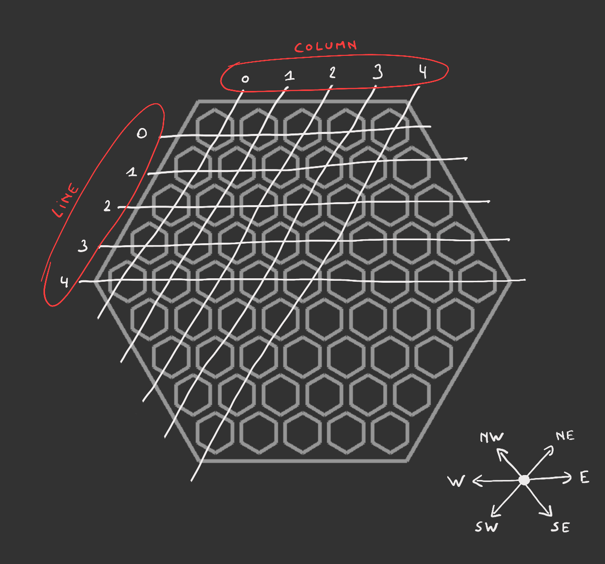

# Abalone Game



## The State

```json
{
   "players": ["LUR", "LRG"],
   "current": 0,
   "board": [
      ["W", "W", "W", "W", "W", "X", "X", "X", "X"],
      ["W", "W", "W", "W", "W", "W", "X", "X", "X"],
      ["E", "E", "W", "W", "W", "E", "E", "X", "X"],
      ["E", "E", "E", "E", "E", "E", "E", "E", "X"],
      ["E", "E", "E", "E", "E", "E", "E", "E", "E"],
      ["X", "E", "E", "E", "E", "E", "E", "E", "E"],
      ["X", "X", "E", "E", "B", "B", "B", "E", "E"],
      ["X", "X", "X", "B", "B", "B", "B", "B", "B"],
      ["X", "X", "X", "X", "B", "B", "B", "B", "B"]
   ]
}
```

The first player that appears in the `players` list is the player that begin the game with the black marbles.

`current` is the indice of the current player in the `players` list.

The `board` is a list of lines. `'W'` stands for White, `'B'` for Black, `'E'` for Empty and `'X'` for outside the board.

## A Move

```json
{
   "marbles": [[1, 1], [2, 2]],
   "direction": "SE"
}
```

`marbles` list the marbles you want to move. Coordinates are `[line, column]`.

`direction` is the direction of he move.

You can pass your turn by sending an empty marbles list.
